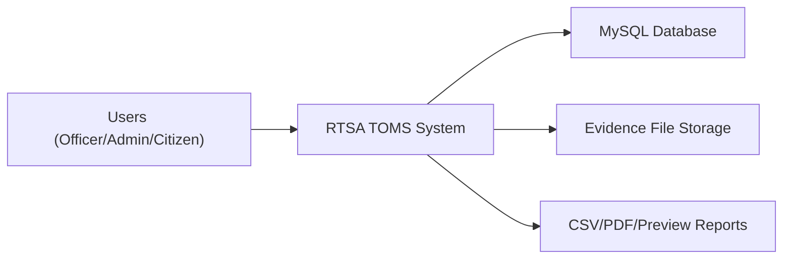
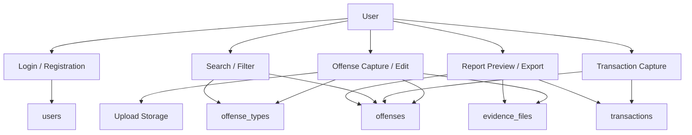
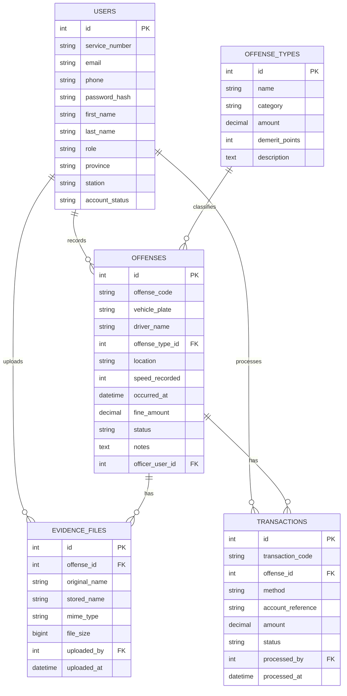

# RTSA / ZP Traffic Offense Management System

## What is included

This project turns the original single-file HTML prototype into a PHP/MySQL web system with:

- External stylesheet in [styles.css](/C:/Users/windows%2010/Documents/New%20project/assets/css/styles.css)
- PHP session login and registration in [index.php](/C:/Users/windows%2010/Documents/New%20project/index.php) and [index.php](/C:/Users/windows%2010/Documents/New%20project/api/index.php)
- MySQL schema in [schema.sql](/C:/Users/windows%2010/Documents/New%20project/database/schema.sql)
- One-step installer and seed data in [install.php](/C:/Users/windows%2010/Documents/New%20project/database/install.php)
- Frontend integration code in [app.js](/C:/Users/windows%2010/Documents/New%20project/assets/js/app.js)
- Preview, CSV, and PDF reports in [report_preview.php](/C:/Users/windows%2010/Documents/New%20project/api/report_preview.php), [export_csv.php](/C:/Users/windows%2010/Documents/New%20project/api/export_csv.php), and [export_pdf.php](/C:/Users/windows%2010/Documents/New%20project/api/export_pdf.php)
- File upload support for photo and video evidence in [index.php](/C:/Users/windows%2010/Documents/New%20project/index.php) and [index.php](/C:/Users/windows%2010/Documents/New%20project/api/index.php)

## Main features

### 1. Authentication

- Login only succeeds when the service number, email, or phone exists in the `users` table.
- Wrong password returns a clear error.
- Missing account returns a clear "account not found" error.
- Registration creates a `PENDING` user for approval.

### 2. Offense management

- Create new offense records.
- Edit existing offense records.
- Auto-calculate fine amount from the selected offense type.
- Save all offense records in MySQL.
- Filter offenses by:
  - keyword
  - offense type
  - status

### 3. Fine schedule management

- Add new offense/fine definitions.
- Edit existing fine definitions.
- Store fine schedule in the `offense_types` table.

### 4. Transactions and dashboard auto-updates

- Record new payment transactions.
- Store transactions in MySQL.
- Auto-update offense payment status.
- Recalculate dashboard totals from live database values.

### 5. Evidence uploads

- Upload multiple files per offense.
- Supports `image/*` and `video/*`.
- Saves file metadata in `evidence_files`.
- Stores uploaded files in `storage/uploads`.

### 6. Reports

- Preview a selected offense report in the browser.
- Export the selected report or filtered list to CSV.
- Export the selected report or filtered list to PDF.
- Open a printable preview page and save as PDF from the browser.

### 7. Mobile / phone view

- The login and registration sections remain visible on smaller screens.
- The responsive updates are in [styles.css](/C:/Users/windows%2010/Documents/New%20project/assets/css/styles.css).

## File-by-file code summary

### Frontend

- [index.php](/C:/Users/windows%2010/Documents/New%20project/index.php)
  - Main UI entry point.
  - Uses the original layout.
  - Adds IDs and hooks for live forms, filters, preview modal, and fine editor modal.

- [styles.css](/C:/Users/windows%2010/Documents/New%20project/assets/css/styles.css)
  - Extracted from the original HTML.
  - Keeps the original look.
  - Adds mobile fixes for phone login and registration display.

- [legacy-ui.js](/C:/Users/windows%2010/Documents/New%20project/assets/js/legacy-ui.js)
  - Preserves navigation, modal helpers, toast notifications, charts, and canvas drawing from the original prototype.

- [app.js](/C:/Users/windows%2010/Documents/New%20project/assets/js/app.js)
  - Connects UI to PHP APIs with `fetch`.
  - Handles login, registration, CRUD, filters, exports, uploads, report preview, and dashboard refresh.

### Backend

- [bootstrap.php](/C:/Users/windows%2010/Documents/New%20project/config/bootstrap.php)
  - Database connection.
  - JSON helpers.
  - Session helpers.
  - Shared data access helpers.

- [index.php](/C:/Users/windows%2010/Documents/New%20project/api/index.php)
  - Main API router.
  - Handles auth, dashboard, offenses, fines, evidence, and transactions.

- [simple_pdf.php](/C:/Users/windows%2010/Documents/New%20project/config/simple_pdf.php)
  - Lightweight PDF generator without external libraries.

- [report_preview.php](/C:/Users/windows%2010/Documents/New%20project/api/report_preview.php)
  - HTML preview page for selected or filtered reports.

- [export_csv.php](/C:/Users/windows%2010/Documents/New%20project/api/export_csv.php)
  - CSV export endpoint.

- [export_pdf.php](/C:/Users/windows%2010/Documents/New%20project/api/export_pdf.php)
  - PDF export endpoint.

### Database

- [schema.sql](/C:/Users/windows%2010/Documents/New%20project/database/schema.sql)
  - Creates all MySQL tables.

- [install.php](/C:/Users/windows%2010/Documents/New%20project/database/install.php)
  - Runs the schema.
  - Seeds sample users, offenses, fine types, and transactions.

## Data flow diagrams

### DFD Level 0



### DFD Level 1



## ERD



## Basic setup

1. Create a MySQL database named `rtsa_toms`.
2. Set these environment variables if your MySQL settings differ:
   - `RTSA_DB_HOST`
   - `RTSA_DB_PORT`
   - `RTSA_DB_NAME`
   - `RTSA_DB_USER`
   - `RTSA_DB_PASS`
3. Run [install.php](/C:/Users/windows%2010/Documents/New%20project/database/install.php) once.
4. Serve the project with PHP, for example:

```powershell
php -S localhost:8000
```

5. Open `http://localhost:8000`.

## Seed login accounts

- Officer: `RTZ-20240001` / `password`
- Admin: `ADM-20240001` / `password`
- Citizen: `CTZ-20240001` / `password`

## Data flow in plain words

1. User logs in.
2. PHP checks the `users` table.
3. User records an offense.
4. PHP saves the offense in `offenses`.
5. Evidence files are saved in `storage/uploads` and metadata goes to `evidence_files`.
6. Payments are saved in `transactions`.
7. Dashboard totals are recalculated from live database queries.
8. Reports pull data from MySQL and export it as preview, CSV, or PDF.
